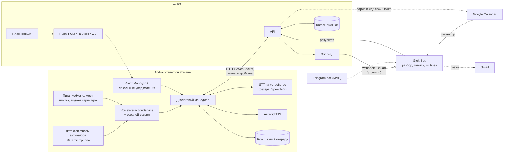

# Личный голосовой помощник для Android, связанный с Grok Bot: проектный документ

**Пользователь:** Роман Богомолов · **Часовой пояс:** Europe/Moscow (МСК, UTC+3) · **Дата:** 06.10.2026 · **Статус:** черновик, код не пишется

Исходные условия: только Android, телефон — **Honor Magic 7 Pro на Android 16 (MagicOS 10)**; регион прошивки и наличие YOYO не подтверждены; наше приложение будет **помощником по умолчанию** вместо Google (Роман согласен); утренняя сводка — **06:00 МСК**; фраза-активатор — **«Окей, Гога»**; одно устройство и один пользователь, поэтому входа по аккаунту нет; Роман пользуется Google Календарём (подключается к Grok Bot через коннектор, путь (а); авторизация в процессе) и Gmail; заметки и задачи хранятся в отдельном модуле. GitHub у Романа есть, репозиторий подключим следующим шагом.

---

## (а) Краткое описание

Это голосовой помощник, встроенный в Android. Роман выбирает его в настройках как «Цифровой помощник по умолчанию». После этого помощника можно вызвать долгим нажатием кнопки питания или Home, жестом из угла экрана, плиткой в шторке, кнопкой гарнитуры или своей фразой-активатором **«Окей, Гога»**, в том числе на заблокированном экране. Голосом можно надиктовать заметку, задачу, событие или напоминание. Помощник отвечает голосом и текстом, сам напоминает в нужное время, а на напоминание можно ответить голосом («готово», «отложи на час»).

Телефон служит интерфейсом: микрофон, распознавание речи, озвучка ответов, уведомления и локальные будильники. «Мозг» — Grok Bot: он разбирает смысл фразы, ведёт память и расписания (routines), работает с Google Календарём через коннекторы. Между телефоном и ботом стоит небольшой шлюз (API, очередь, push, хранилище заметок и задач). Точный механизм связи шлюза с ботом — webhook-триггер routine, канал сообщений или что-то другое — **нужно уточнить**: публичный API Grok Bot в этом документе не описывается.

---

## (б) Структура и архитектура

### 1. Что Android реально даёт стороннему приложению

Проверено по developer.android.com, исходникам AOSP и справке Google Play (ссылки в конце).

| Возможность | Статус | Пояснение |
|---|---|---|
| Роль помощника по умолчанию (`RoleManager.ROLE_ASSISTANT`) | ✅ Доступно | Чтобы получить роль, приложение реализует `VoiceInteractionService` (с `VoiceInteractionSessionService`) и/или обрабатывает `ACTION_ASSIST`. Роль выбирает сам пользователь: «Настройки → Приложения → Приложения по умолчанию → Цифровой помощник». После этого помощник вызывается долгим нажатием питания/Home или жестом; путь в настройках зависит от производителя. |
| Запуск на заблокированном экране | ✅ Доступно | Флаг `supportsLaunchVoiceAssistFromKeyguard` и `onLaunchVoiceAssistFromKeyguard()`. Окно показывается поверх экрана блокировки с `FLAG_SHOW_WHEN_LOCKED`. Что разрешено делать без разблокировки, решаем сами (см. «Безопасность»). |
| Контекст экрана («что я сейчас смотрю») | ✅ С оговорками | Помощник по умолчанию в момент вызова получает `AssistStructure`/`AssistContent` текущего приложения. Пользователь может отключить «Использовать текст с экрана»; некоторые приложения помечают окна как защищённые. Контекст приходит только по вызову, а не постоянно. |
| Системный детектор фразы-активатора (`AlwaysOnHotwordDetector`, `HotwordDetectionService`, DSP-модели) | ❌ Недоступно | Это `@SystemApi`. Нужны разрешения `MANAGE_HOTWORD_DETECTION` (уровень signature) и `CAPTURE_AUDIO_HOTWORD`, а значит предустановка в `system/priv` или подпись платформы. В AOSP прямо сказано: «not a third-party API (intended for OEMs and system apps)». Ни Play, ни прямая установка APK этого не меняют. |
| «Окей, Google» или Gemini для нашей фразы | ❌ Недоступно | Чужую фразу-активатор переиспользовать нельзя. По справке Google, «Hey Google» требует, чтобы приложение Google было помощником по умолчанию. Если помощником станет наше приложение, фраза Google на большинстве устройств перестанет работать. Gemini при этом можно открывать как обычное приложение. |
| Своя фраза-активатор в foreground service типа `microphone` | ⚠️ С оговорками | Технически работает, это стандартный путь для сторонних приложений. Ограничения: (1) постоянное уведомление; (2) индикатор микрофона в статус-баре горит всё время прослушивания; (3) расход батареи нужно замерить; (4) на Android 14+ такую службу нельзя запустить из фона и из `BOOT_COMPLETED`, кроме исключений. **Важное исключение:** приложение, предоставляющее `VoiceInteractionService`, входит в список исключений, как и запуск из уведомления или виджета. Поэтому роль помощника помогает и здесь. (5) Агрессивные энергосберегающие оболочки, в том числе **MagicOS на Honor Magic 7 Pro**, могут убивать службу; нужны ручные настройки запуска и батареи (инструкция — Приложение А.4). |
| Плитка Quick Settings, виджет, ярлыки App Shortcuts, действие в уведомлении | ✅ Доступно | Это дополнительные точки входа. Нажатие на виджет или уведомление — законное основание включить микрофон из фона. |
| Кнопка Bluetooth-гарнитуры | ⚠️ С оговорками | Долгое нажатие обычно вызывает голосового помощника по умолчанию (`ACTION_VOICE_COMMAND`/assist). Поведение зависит от гарнитуры и прошивки, нужно проверить на устройстве Романа. |
| `AccessibilityService` для «управления всем телефоном» | ⚠️ Не рекомендуется | Play разрешает его и не-специальным приложениям, но требует декларацию, отдельное заметное раскрытие и согласие. Флаг `isAccessibilityTool=true` можно ставить только инструментам для людей с инвалидностью. Политика прямо запрещает «использовать API для автономного инициирования, планирования и выполнения действий». При прямой установке APK Android 13+ блокирует включение спецвозможностей («Ограниченные настройки») до ручного разрешения. Для v1 не нужен. |
| Прямая установка APK (sideload) для личного использования | ✅ С оговорками | Снимает ревью Play: декларации FGS, политику спецвозможностей, сроки публикации. **Системные и привилегированные разрешения не даёт** (hotword, DSP и т. п.). Установка через ADB остаётся вне требований верификации разработчиков. С 30.09.2026 верификация действует только в Бразилии, Индонезии, Сингапуре и Таиланде; глобально Google планирует 2027 год. После этого для установки не через ADB понадобится зарегистрированный разработчик или «advanced flow»: включение в настройках, перезагрузка, ожидание 24 ч. |
| Точные будильники для напоминаний | ⚠️ С оговорками | На Android 14+ `SCHEDULE_EXACT_ALARM` по умолчанию запрещён для новых установок; пользователь включает его в настройках. Проверка — `canScheduleExactAlarms()`, при отказе используется неточный будильник. |

### 2. Рекомендация: что входит в v1

1. **Роль помощника по умолчанию.** `VoiceInteractionService`, `VoiceInteractionSessionService` с оверлей-сессией (нижняя «шторка» поверх любого приложения) и работа на экране блокировки. Это главный способ вызова, без постоянного прослушивания.
2. **Фраза-активатор «Окей, Гога» — включаемая опция**, по умолчанию выключена. Режимы: «Всегда», «Только на зарядке», «По расписанию». Работает в FGS `microphone` с постоянным уведомлением. Движок для прототипа:
   - **openWakeWord** — своя модель, первая ступень;
   - **Vosk small-ru** в режиме грамматики с фразами-конкурентами («окей гугл», «окей гоша», «окей хорошо») — вторая ступень проверки;
   - **microWakeWord** — план Б;
   - **Porcupine не подходит**: бесплатные ключи отключены с 30.06.2026, русский — только для коммерческих клиентов.
   Подробности, тесты и критерии — **Приложение А**.
3. **Распознавание речи (STT).** Основной вариант — системный `SpeechRecognizer` на устройстве (`createOnDeviceSpeechRecognizer`, API 31+, ru-RU), если `isOnDeviceRecognitionAvailable()`. Резерв — облачный **Yandex SpeechKit** (потоковый gRPC v3, оплата за 15-секундные отрезки) через шлюз; можно также Vosk офлайн.
4. **Озвучка ответов (TTS).** Системный Android `TextToSpeech` с русским голосом; облачный синтез (например SpeechKit) — опция.
5. **Дополнительные точки входа:** плитка в шторке, виджет на рабочем столе, кнопки в уведомлениях («Готово», «Отложить», «Ответить голосом»), кнопка гарнитуры.
6. **Не входит в v1:** AccessibilityService, контекст экрана (это v1.1), Gmail, звонки и SMS.

### 3. Компоненты

| Компонент | Назначение |
|---|---|
| **Android-клиент (Kotlin + Jetpack Compose, нативный)** | Все ключевые функции системные: VoiceInteractionService, FGS, AlarmManager, RoleManager, SpeechRecognizer. Во Flutter или React Native их пришлось бы писать нативными модулями, поэтому кроссплатформенность выигрыша не даёт: iOS не планируется, а API помощника на iOS всё равно другие. Flutter можно рассмотреть только для обычных экранов (списки, настройки), но для v1 это лишняя сложность. |
| ├ Служба помощника | `VoiceInteractionService` и сессия-оверлей; запуск по жесту, кнопке, экрану блокировки. |
| ├ Детектор фразы-активатора | FGS `microphone` + openWakeWord/Vosk; после срабатывания открывает сессию. |
| ├ STT/TTS | Распознавание на устройстве, облачный резерв; системный TTS. |
| ├ Диалоговый менеджер (на клиенте) | Состояния: слушаю → распознал → отправил → жду ответ → озвучиваю → жду короткий ответ («да/нет/отложи»). Таймауты, повтор, переключение на текст. |
| ├ Локальное хранилище и исходящая очередь | Room (SQLite): кэш заметок, задач, напоминаний и неотправленных команд. |
| └ Планировщик напоминаний | AlarmManager (точные будильники) с локальными уведомлениями; расписание заранее синхронизируется со шлюза. |
| **Шлюз-бэкенд** (небольшой сервис: API + очередь + планировщик + push) | Приём команд с телефона, передача в Grok Bot, приём ответов и действий бота, хранение заметок и задач (модуль «Notes/Tasks»), отправка push, журнал. Если нужен свой OAuth к Google — хранит refresh-токен. Опциональный «быстрый путь»: простые команды вида «напомни в 18:00» разбирает сам, чтобы не ждать бота. |
| **Grok Bot** | Разбор смысла (заметка, задача, событие, напоминание; дата и время в МСК), память, routines (утренняя сводка по cron), Google Calendar и позже Gmail через коннекторы. |
| **Провайдеры календаря (абстракция `CalendarProvider`)** | v1: **Google Calendar API**. Дальше за тем же интерфейсом: Яндекс Календарь по CalDAV (`caldav.yandex.ru`, пароль приложения) и нативный `CalendarContract`. |
| **Модуль Notes/Tasks** | v1: своя БД на шлюзе. Опционально — экспорт в **Google Tasks API**. Google Keep API доступен только в корпоративной среде Workspace, для личного аккаунта не подходит. |
| **Push (абстракция `PushChannel`)** | FCM и RuStore Push, плюс собственный постоянный канал (WebSocket) при работающей FGS. |

### 4. Связь с Grok Bot (варианты, механизм уточнить)

1. **Свой шлюз + webhook (рекомендуется).** Шлюз отправляет событие в webhook-триггер routine бота. Бот выполняет действие (например создаёт событие в Google Calendar через коннектор) и возвращает результат: вызывает API шлюза с секретом или отвечает в настроенный канал. **Уточнить:** поддерживает ли Grok Bot исходящий HTTP из routine, задержку запуска (секунды или минуты), формат ответа, может ли шлюз работать на компьютере самого бота и есть ли у него входящий адрес.
2. **Шлюз как «канал сообщений» бота.** Если бот позволяет подключить собственный канал (по аналогии с Telegram/Slack), шлюз выглядит для него как чат. Это проще для диалога. **Уточнить**, есть ли такой тип канала.
3. **Временный MVP без своего приложения — Telegram-бот.** Роман пишет или говорит в Telegram, бот отвечает и присылает напоминания. Плюсы: ничего не нужно разрабатывать на телефоне, старт за дни. Минусы для РФ: с 10.02.2026 Роскомнадзор замедляет Telegram, сильнее всего страдают медиа и голосовые; уведомления Telegram на Android зависят от FCM, а в июне 2026 сообщалось о массовом недоходе push без средств обхода. Голосового помощника «в телефоне» так не получить.

**Поток «запрос → ответ»:** фраза-активатор или жест → сессия → STT → текст и метаданные (время МСК, источник, `idempotency_key`) → шлюз `POST /commands` → очередь → Grok Bot (разбор и действие в Google Calendar) → результат в шлюз → ответ клиенту (WebSocket или push) → TTS «Записал: встреча с Иваном завтра в 15:00».
**Поток напоминаний:** бот или шлюз создаёт напоминание → шлюз хранит его и заранее отправляет расписание на телефон → телефон ставит точный будильник (**основной путь**, работает без сети) → в нужное время срабатывает локальное уведомление с озвучкой. Push (FCM/RuStore/WebSocket) нужен для изменений, отмен и срочных сообщений бота. Утренняя сводка: routine по cron (06:00 МСК) → бот собирает день → шлюз → push или WebSocket → озвучка по нажатию или автоматически.

### 5. Доступ к Google Calendar (и позже Gmail)

| | (а) Через коннекторы Grok Bot | (б) Свой OAuth на шлюзе |
|---|---|---|
| Суть | Роман один раз подключает Google Calendar и Gmail к боту. У приложения и шлюза нет токенов Google. | Одноразовое «подключение сервиса» по ссылке в браузере (не вход в приложение). Refresh-токен хранится зашифрованным на шлюзе. |
| Нужно | Коннектор Google Calendar в боте (уточнить наличие и возможности: создание, изменение, удаление событий, напоминания). | Проект Google Cloud, экран согласия, клиент OAuth. Scope `calendar.events` относится к чувствительным (sensitive). |
| Подводные камни | Каждая операция зависит от скорости бота; быстрые локальные проверки вроде «свободен ли я в 15:00» требуют запроса к боту. | В режиме **Testing** refresh-токен живёт **7 дней** (лимит 100 тестовых пользователей). Нужно перевести в **In production**: без верификации будет экран «непроверенное приложение» и лимит 100 пользователей. Для одного пользователя Google прямо допускает исключение «personal use». Gmail `gmail.readonly`/`modify` — **ограниченные** (restricted) scope'ы: для публичного приложения это верификация и ежегодная проверка безопасности; для личного использования — исключение. `gmail.send` — sensitive. |
| **Рекомендация** | **Основной путь v1**, если коннектор бота умеет писать события. | Резерв: если коннектора нет, нужен прямой и быстрый доступ или push-уведомления об изменениях календаря. Сразу Production + personal use, минимальные scope'ы. |

Напоминания: напоминание о событии ставим как `reminders` в Google Calendar (их увидят все устройства Романа) **и** как локальный будильник в нашем приложении (озвучка и голосовой ответ). Gmail в v1 не входит; дальше — источник задач и событий из писем и резервный канал доставки сводки.

### 6. Данные, авторизация, офлайн, безопасность

- **Хранение.** Шлюз: заметки, задачи, напоминания, устройство, журнал (PostgreSQL или SQLite, шифрование диска, ежедневный бэкап). Телефон: кэш в Room и очередь неотправленных команд. Аудио по умолчанию не сохраняется: на сервер уходит текст; аудио — только при облачном STT, без хранения.
- **Авторизация без входа.** Сопряжение: бот или шлюз выдаёт одноразовый код или QR, телефон получает **токен устройства**, хранит его в Android Keystore и подписывает запросы. Отзыв токена — командой боту. Связь шлюза с ботом — общий секрет или подпись webhook (HMAC).
- **Офлайн.** Работает: фраза-активатор и STT на устройстве, создание заметки или напоминания в очередь, срабатывание уже синхронизированных напоминаний, «Готово/Отложить». При появлении сети очередь отправляется с `idempotency_key`, без дублей.
- **Экран блокировки.** Без разблокировки можно создать заметку, задачу или напоминание и ответить на напоминание. Чтение списков, сводки и содержимого заметок — только после разблокировки (`requestDismissKeyguard`).
- **Приватность.** Постоянное уведомление и индикатор микрофона при активной фразе-активаторе. Явный экран раскрытия перед запросом микрофона и роли помощника. Журнал срабатываний фразы-активатора (без аудио), чтобы видеть ложные срабатывания.

### 7. Экраны

1. **Первый запуск:** раскрытие (микрофон, роль помощника, точные будильники, уведомления, исключение из оптимизации батареи) → сопряжение с ботом → проверка связи → «Подключите Google Календарь в боте» со статусом подключения.
2. **Оверлей-сессия:** анимация «слушаю», живая расшифровка, карточка распознанного («Задача · завтра 10:00 · Изменить / Отмена»), озвучка.
3. **Главный экран «Сегодня»:** события (Google Calendar), задачи, напоминания; кнопка микрофона и строка ввода текста.
4. **Списки:** заметки, задачи, напоминания с фильтрами, правкой, отметкой «выполнено» и удалением.
5. **Настройки:** режим фразы-активатора, чувствительность, своя фраза; STT на устройстве или в облаке; голос TTS; время утренней сводки; push-канал; диагностика (статус FGS, батарея, последний push).

### 8. Этапы

- **Этап 0 — MVP через Telegram (1–2 недели):** текст и голос → Grok Bot → Google Calendar через коннектор; напоминания и утренняя сводка сообщениями. Цель — проверить разбор фраз и работу коннектора. Риски Telegram в РФ описаны выше.
- **v1 — помощник в телефоне:** роль помощника, оверлей и экран блокировки; опциональная фраза-активатор (FGS); STT на устройстве с облачным резервом; TTS; шлюз (API, очередь, push, Notes/Tasks); локальные напоминания с голосовым ответом; Google Calendar; утренняя сводка; установка APK через ADB или напрямую.
- **v1.1:** контекст экрана через `AssistStructure` («запомни это», «напомни про эту страницу»); Gmail как источник задач и событий и как резервный канал сводки; экспорт в Google Tasks.
- **Дальше:** провайдеры Яндекс CalDAV и `CalendarContract`; публикация в Play или RuStore; звонки и SMS через сторонний сервис (см. «Открытые вопросы»); носимые устройства и Android Auto.

---

## (в) Сценарии работы

**1. Голосовая заметка, hands-free.**
Роман: «Окей, Гога» → короткий сигнал → «Заметка: идея — сделать сравнение тарифов хостинга».
Помощник (голосом): «Записал заметку „сравнение тарифов хостинга“».
*Внутри:* фраза-активатор → сессия → STT → шлюз → бот определил тип «заметка» → сохранено в Notes. Если сети нет, ответ: «Записал, отправлю, когда появится сеть».

**2. Задача с дедлайном.**
Роман (долгое нажатие питания): «Подготовить отчёт по проекту до пятницы, напомни в четверг вечером».
Помощник: «Задача „отчёт по проекту“, срок — пятница, 9 октября. Напомню в четверг, 8 октября, в 19:00. Верно?» — Роман: «Да». — «Готово».
*«Вечер» по умолчанию означает 19:00 МСК; это настраивается.*

**3. Событие в календарь.**
Роман: «Встреча с Иваном завтра в три на час».
Помощник: «Создаю в Google Календаре: „Встреча с Иваном“, среда, 7 октября, 15:00–16:00. Напомнить за 15 минут?» — «Да». — «Добавил».
*Если календарь не подключён:* «Google Календарь пока не подключён. Сохранил это как напоминание на завтра в 14:45 и отправил вам инструкцию, как подключить календарь в боте. После подключения перенесу событие». Событие ждёт в очереди «на перенос».
*Если время занято:* «В 15:00 у вас „Созвон с командой“. Всё равно поставить или выбрать 16:00?»

**4. Напоминание и реакция на него.**
В четверг в 19:00 МСК срабатывает локальный будильник → уведомление с кнопками «Готово / Отложить / Ответить голосом». Если включена озвучка, звучит: «Напоминаю: подготовить отчёт по проекту. Готово или отложить?»
Роман: «Отложи на час». — «Напомню в 20:00».
На заблокированном экране работает так же; посмотреть всю задачу можно только после разблокировки. Без сети напоминание всё равно сработает, потому что расписание уже на телефоне; ответ уйдёт на шлюз позже.

**5. Утренняя сводка.**
06:00 МСК: routine бота собирает события из Google Calendar, задачи со сроком на сегодня и просроченные → push «Сводка на сегодня».
Роман (жест или фраза): «Что у меня сегодня?»
Помощник: «Сегодня три события: в 10:00 стендап, в 15:00 встреча с Иваном, в 18:30 спортзал. Две задачи: отчёт до пятницы и оплатить интернет. Хотите подробнее?»

**6. Просмотр и правка списка.**
«Какие у меня задачи на неделю?» → помощник зачитывает первые пять и показывает список на экране.
«Перенеси оплату интернета на понедельник» → «Перенёс „оплатить интернет“ на понедельник, 12 октября».
«Удали заметку про хостинг» → «Удалить заметку „сравнение тарифов хостинга“? Скажите „да“». Удаление всегда требует подтверждения.

**7. Ошибка распознавания и уточнение.**
Роман: «Напомни позвонить Сергею в пять».
Помощник: «В 17:00 сегодня или в 5:00 утра завтра?» — «Вечером». — «Напомню сегодня в 17:00».
Если STT не уверен: «Не расслышал имя. Сергею или Серёже Иванову?» Если два ответа подряд не распознаны: «Давайте текстом» — открывается поле ввода с распознанным черновиком. Ложное срабатывание фразы-активатора: если 5 секунд нет речи, сессия молча закрывается, событие записывается в журнал.

---

## (г) Открытые вопросы

1. **Телефон — известен: Honor Magic 7 Pro, Android 16 (MagicOS 10).** Ждём регион прошивки (глобальная, российская или китайская, то есть есть ли GMS и FCM; посмотреть в «Настройки → О телефоне»). Нужно проверить, есть ли YOYO с голосовой активацией и вызывает ли долгое нажатие питания помощника по умолчанию (Приложение А.4).
2. **Помощник по умолчанию — решено:** Роман согласен заменить Google нашим приложением. Следствие: «Окей, Google» и Gemini hands-free скорее всего перестанут работать; Gemini останется как обычное приложение.
3. **Фраза-активатор — выбрана: «Окей, Гога».** Открыто: режим работы (всегда, на зарядке или по расписанию), согласие на постоянное уведомление и индикатор микрофона, допустимый расход батареи. Нужны записи голоса Романа (Приложение А.5). Главный риск — путаница с «Окей, Гугл»; меры описаны в А.3.
4. **Play или прямая установка.** Для личного использования достаточно ADB или APK; Play требует декларации FGS и проверки. Учесть план Google на глобальную верификацию разработчиков в 2027 году: ADB останется исключением, для остального понадобится регистрация в Android Developer Console или «advanced flow». RuStore — как альтернативный магазин (уточнить требования).
5. **Связь с Grok Bot.** Механизм (webhook-триггер routine, канал сообщений, собственный шлюз), задержка ответа, может ли бот вызывать API шлюза, где размещён шлюз (компьютер бота, VPS в РФ или за рубежом).
6. **Доступ к Google и отсутствие входа по аккаунту.** В варианте (а) у приложения нет Google-аккаунта и токенов, только токен устройства от сопряжения: это лучше всего сочетается с «без входа». В варианте (б) Google-OAuth — это не вход в приложение, а одноразовое подключение сервиса на шлюзе (ссылка из бота или из настроек); токен хранится на шлюзе, телефон его не видит. **Решено: путь (а)** — Google Календарь подключается к Grok Bot через коннектор, авторизация в процессе. Осталось проверить после подключения, что коннектор умеет создавать, менять и удалять события и ставить напоминания. Путь (б) остаётся резервом: проект Google Cloud в режиме Production + personal use, чтобы токен не истекал через 7 дней.
7. **Где хранить заметки и задачи.** Своя БД на шлюзе (рекомендуется) или Google Tasks как основное хранилище или зеркало. Google Keep для личного аккаунта не подходит.
8. **Push в РФ.** FCM работает нестабильно: IP-адреса Google ограничиваются у операторов, есть сообщения о недоходе push. RuStore Push требует установленного и авторизованного приложения RuStore. Решение: локальные будильники как основа плюс WebSocket при работающей FGS. Есть ли на телефоне RuStore?
9. **Звонки (не обещаем).** Голосовые звонки-напоминания через API российских шлюзов: например у SMSC есть голосовые сообщения (`call=1`, синтез текста). Нужно проверить стоимость, тип номера отправителя и согласие на звонки. Twilio и Vonage для РФ — см. п. 10.
10. **SMS (не обещаем).** Twilio: в РФ доставляются только SMS от заранее зарегистрированных буквенных имён, новых регистраций нет с июля 2024, двусторонние SMS не поддерживаются. Vonage: РФ в списке ограниченных стран из-за санкций, новые клиенты, связанные с РФ, не принимаются. SMS.ru и SMSC: работают, но буквенное имя отправителя требует согласования с документами ООО/ИП, домена или товарного знака; для физлица это под вопросом. Вывод: SMS как резервный канал возможен только через российский шлюз и с оформлением; в v1 не входит.
11. **Аккаунты разработчика и оплата.** Google Play — **$25 один раз** (актуально на 10.2026). Российские карты не принимаются, нужна зарубежная карта или посредник; бесплатные приложения российским разработчикам публиковать можно, монетизацию Google отключил. Apple ($99/год) не нужен, пока платформа — только Android. Для личной установки аккаунт не нужен вовсе. Yandex Cloud (SpeechKit) — если нужен облачный STT.
12. **Что нужно от Романа для старта.** Уже известно: модель, Android 16, фраза, согласие на помощника по умолчанию, путь (а) для календаря, сводка в 06:00 МСК. Ждём: завершения авторизации Google Календаря в боте; подключения GitHub (аккаунт есть — создать репозиторий и дать доступ); региона прошивки и наличия YOYO; что значит «вечер» (по умолчанию 19:00). Плюс записи голоса для фразы-активатора (А.5), решение, где размещать шлюз, и нужен ли MVP через Telegram на время разработки.

---

## Приложение А. Фраза-активатор «Окей, Гога» и Honor Magic 7 Pro

*Проверено 06.10.2026. Опыты на Vosk и Piper поставлены на моём компьютере (x86-сервер), а не на телефоне. Это ориентиры, а не замеры на Honor.*

### А.1. openWakeWord

- **Русский язык.** Официально не поддерживается: в README сказано, что поддерживается только английский. Автор пишет, что сам пайплайн обучения, включая генерацию негативных примеров, «designed and tested to only work with English». Обойти это можно сторонним, не зависящим от языка тренером `interkelstar/openwakeword-trainer` (MIT). У него есть готовые русские конфиги: голоса Piper `ru_RU` (dmitri, denis, irina, ruslan), русские фразы-ловушки и реальная русская речь как негативы (`bond005/sberdevices_golos_10h_crowd`).
- **TTS для синтетики.** Piper ru — 4 голоса medium, 22 кГц. Лицензии датасетов: dmitri и denis — CC0, irina — «Unknown», ruslan — CC BY-NC-SA 4.0. Silero TTS: основные модели под CC BY-NC 4.0 (некоммерческая), базовые `cis-tts` — под MIT. Для личного использования подходят все; при публикации оставлять dmitri и denis. Мало дикторов — главный недостаток: тренер советует добавлять голоса или клонирование голоса.
- **Обучение.** Официальный Colab для английского — «<1 часа», качество базовое. Русский тренер: около 50 тыс. TTS-клипов (минимум 25 тыс., для продакшена 100 тыс.+), 10 тыс. на валидацию. На CPU — 10–17 ч, на GPU NVIDIA — 2–4 ч. Подойдёт Colab с GPU или любая машина с NVIDIA; диск около 15 ГБ.
- **Честный результат у автора тренера.** Русское «Джарвис», только синтетика: точность на валидации около 99,8%, но **на реальных записях лишь ~45–60%**, ложные срабатывания трудно настроить. На том же пайплайне с моделью **microWakeWord** (Apache-2.0, потоковая CNN, 50–300 КБ) и сбором реальных ложных срабатываний он получил **94% (47/50)** и 1 ложное срабатывание из 140 трудных случаев.
- **Голос Романа.** Для verifier-модели (второй этап, логистическая регрессия «это Роман») openWakeWord требует минимум 3 позитивных записи и около 10 с обычной речи Романа. Для валидации и дообучения записей нужно больше (см. А.5).
- **Android.** Готовая Kotlin-библиотека `Re-MENTIA/openwakeword-android-kt` (Apache-2.0, ONNX Runtime, Maven `xyz.rementia:openwakeword`). Модели: `melspectrogram.onnx` + `embedding_model.onnx` + своя. Есть C++-порт `openWakeWord-cpp`. Обработка идёт кадрами по 80 мс; по README одно ядро Raspberry Pi 3 тянет 15–20 моделей в реальном времени, поэтому для Snapdragon 8 Elite нагрузка ожидается малой, но это нужно замерить. Готового Android-рантайма для microWakeWord я не нашёл: нужен порт micro-frontend и TFLite (LiteRT) — дополнительная работа.
- **Лицензии.** Код openWakeWord — Apache-2.0. Готовые модели — CC BY-NC-SA 4.0, но нам они не нужны: свою модель обучаем сами. Её лицензия зависит от лицензий использованных данных (голоса Piper, негативные датасеты).

### А.2. Vosk (малая русская модель, режим грамматики)

- **Словарь проверен локально** на `vosk-model-small-ru-0.22` (около 88 МБ в распакованном виде):
  - есть: «окей», «оке», «оки», «ок», «гога», «гоги», «гоша», «гугл», «гоголь», «йога», «ага»;
  - нет: «окэй», «гоге», «гогу», «гугол».
  Значит, «окей гога» работает в режиме грамматики **без пересборки**. Если понадобится новое слово, малые модели позволяют на лету только сузить словарь; новые слова добавляются пересборкой графа (лексикон Kaldi, LM, компиляция HCLG). Это возможно для большой русской модели и требует инструментов Kaldi/OpenFST — несколько часов работы специалиста.
- **Мини-тест (синтетика Piper, 2 голоса, 12 фраз).**
  - Грамматика `["окей гога","[unk]"]`: «Окей, Гога» распознаётся. Но **«Окей, Гугл» и «Окей, Гоша» тоже превращаются в «окей гога»**, а уверенность слов в режиме грамматики почти всегда 1.0, то есть бесполезна.
  - После добавления конкурентов (`"окей гугл"`, `"окей гоша"`, `"окей хорошо"`) «Гоша» и «хорошо» отсеялись, «Гугл» — у одного голоса из двух.
  - **Вывод:** Vosk плохо отвергает созвучные фразы. Как единственный детектор он слаб, как второй этап с явными конкурентами — полезен.
- **Нагрузка.** На одном ядре x86 грамматика работает при RTF ≈ 0,03 (около 3% ядра при непрерывном потоке), свободное распознавание — RTF ≈ 0,26. На телефоне цифры будут другими. Ожидаемо грамматика Vosk дороже лёгкого классификатора openWakeWord, потому что работает полноценный декодер Kaldi. Итог — только замер на устройстве.
- **Android.** Официальная библиотека `vosk-android` (Apache-2.0).

### А.3. Оценка фразы «Окей, Гога»

- **Плюсы.** 4 слога «о-кей-го-га» с двумя ударными; для фраз-активаторов рекомендуют 3–4 слога и больше. Короткая, легко произносится.
- **Риск 1 — «Окей, Гугл».** Та же структура «окей + г-гласная-г», мини-тест подтвердил путаницу. Если помощником по умолчанию будет наше приложение, «Hey Google» отключится, и Роман реже будет говорить «Окей, Гугл». Но фраза может прозвучать от других людей или из видео.
- **Риск 2 — «окей» очень частое слово** в разговорной речи, плюс «Гога» — реальное уменьшительное имя. Модель должна срабатывать только на всю фразу целиком.
- **Риск 3 — встроенные помощники.** В китайской прошивке Honor есть YOYO с фразой «你好YOYO» и вызовом кнопкой питания. На глобальной Magic 7 Pro предустановлен Gemini. Есть ли YOYO с голосовой активацией в российской или глобальной прошивке — **не подтверждено, проверить на телефоне**. Предустановленный помощник — «привилегированное» приложение, у него приоритет на микрофон. Два обычных приложения одновременно микрофон не получают: наш детектор будет получать тишину, пока микрофон занят записью, звонком или голосовым сообщением. Чужую голосовую активацию (Gemini/«Hey Google», YOYO) лучше выключить.
- **Рекомендации:**
  1. **Двухступенчатая проверка.** Лёгкий детектор (порог с запасом) → буфер ~1,5–2 с → Vosk-грамматика с конкурентами `окей гога | окей гугл | окей гоша | окей хорошо | [unk]` → затем verifier «голос Романа» (по желанию). Сессия открывается, только если победила «окей гога».
  2. **Позитивы с вариантами произношения:** «окей / океей / оке / оки / о'кей», «Гóга», с паузой и без, шёпот, быстро, издалека.
  3. **Негативы:** «окей», «окей, хорошо», «окей, Гугл», «окей, Гоша», «о, Гога», «Гога», «йога», «Гоголь», «ага», плюс русская речь, ТВ и музыка.
  4. **Сбор ложных срабатываний.** Сохранять фрагменты (только с согласия Романа) и дообучать на них. Именно это дало главный выигрыш у автора microWakeWord.

### А.4. Honor Magic 7 Pro и MagicOS

- **Версии.** Глобальная Magic 7 Pro вышла 15.01.2025 с **MagicOS 9.0 (Android 15)**. Глобальное обновление **MagicOS 10 (Android 16)**, сборка 10.0.0.121, раскатывается с февраля 2026 волнами. Российский магазин Honor пишет «MagicOS 9.0». **У Романа — Android 16, то есть MagicOS 10.** Точную сборку и регион прошивки посмотреть в «Настройки → О телефоне».
- **Сервисы Google.** Глобальная и российская версии — с Google Play и сервисами, Gemini предустановлен. Значит, FCM доступен. Китайская версия (если телефон из Китая) — без GMS, FCM нет. Есть сообщения, что MagicOS ночью ограничивает фон и сеть сервисов Google, из-за чего FCM отключается и push пропадают; на MagicOS 10 тоже есть жалобы на push в фоне. Для нас это подтверждает решение: **напоминания на локальных будильниках, push — дополнение**.
- **Фоновые ограничения.** MagicOS унаследовала агрессивное энергосбережение EMUI. Отдельной страницы Honor на dontkillmyapp.com нет (404), Honor описан в разделе Huawei: «Запуск приложений → Управлять вручную», PowerGenie на EMUI. Без ручных настроек служба с микрофоном может быть выгружена. Сломается тогда постоянное прослушивание, а не будильники. После выгрузки или перезагрузки на Android 14+ микрофонную FGS нельзя поднять из фона. Исключения: приложение — держатель `VoiceInteractionService` (проверить на MagicOS) или нажатие на уведомление/виджет. Запасной путь — уведомление «Нажмите, чтобы включить прослушивание».
- **Кнопка питания.** В MagicOS есть пункт «Специальные возможности → Быстрый доступ и жесты → Google Ассистент → Вызов кнопкой питания» (по сообщениям для Magic V3 global). **Не подтверждено**, вызывает ли он помощника по умолчанию или только Google. Если только Google, запасные точки входа — жест из угла, плитка, виджет, фраза-активатор.

**Инструкция первого запуска** (приложение показывает её с кнопками-переходами; *названия пунктов сверить на устройстве, они меняются между MagicOS 9 и 10*):

1. **Помощник по умолчанию:** Настройки → Приложения → Приложения по умолчанию → Цифровой помощник → выбрать наше приложение (или поиск по слову «помощник»). Разрешить «Анализ текста на экране» (по желанию) и работу на экране блокировки.
2. **Кнопка питания:** Настройки → Специальные возможности → Быстрый доступ и жесты → вызов помощника кнопкой питания → включить и проверить, что открывается наш помощник.
3. **Выключить чужую голосовую активацию:** Gemini → Настройки → «Hey Google» и Voice Match → выкл. Если есть YOYO: Настройки → Помощник/YOYO → Голосовое пробуждение → выкл.
4. **Запуск приложений:** Настройки → Батарея → Запуск приложений → наше приложение → выключить «Управлять автоматически» → включить «Автозапуск», «Косвенный (вторичный) запуск», «Работа в фоновом режиме» → ОК.
5. **Батарея приложения:** Настройки → Приложения → Управление приложениями → наше → Батарея → «Без ограничений». Плюс системный запрос «Не оптимизировать батарею», который покажет само приложение.
6. **Закрепить в недавних:** экран «Недавние» → потянуть карточку приложения вниз → замок.
7. **Точные будильники:** Настройки → Приложения → Специальный доступ → «Будильники и напоминания» → разрешить.
8. **Уведомления:** разрешить все каналы, включая показ на экране блокировки; канал «Прослушивание» не скрывать.
9. **Микрофон:** «Разрешить только во время использования» — этого достаточно, постоянное прослушивание идёт через службу с уведомлением.
10. **Проверка:** приложение запускает самотест — фраза «Окей, Гога» при выключенном экране через 10 мин, 1 ч и ночью; тестовое напоминание через 2 мин; push. Результат показывается на экране диагностики.

### А.5. Рекомендация и план прототипа

**Для прототипа берём:**
- **openWakeWord** (своя модель «окей гога», ONNX, готовая Kotlin-библиотека) как первую ступень;
- **Vosk small-ru** в режиме грамматики с конкурентами как вторую ступень (только по срабатыванию первой);
- verifier на голосе Романа — опционально;
- **Vosk без openWakeWord** (непрерывная грамматика) — базовый вариант для A/B-сравнения;
- **microWakeWord** — план Б, если openWakeWord не дотянет по доле срабатываний (дороже из-за порта на Android).

**Шаги (2–3 недели):**
1. Синтетика: Piper ru (dmitri, denis, irina, ruslan), около 50 тыс. позитивов с вариантами произношения, негативы из А.3, русская речь golos.
2. Обучение на GPU (2–4 ч на прогон, 2–3 прогона).
3. Офлайн-оценка на записях Романа.
4. Тестовое Android-приложение: FGS `microphone` + детектор + Vosk-проверка + журнал.
5. Неделя жизни на Magic 7 Pro с настройками А.4; сбор ложных срабатываний; дообучение.

**Критерии успеха** (цели, их можно корректировать):
- доля срабатываний: **≥ 90%** в тишине до 1 м, **≥ 80%** в шуме и на 2–3 м;
- ложные срабатывания: **≤ 0,5 в час** на смешанной речи и ТВ (ориентир openWakeWord), в быту после двух ступеней **≤ 1 в сутки**;
- «Окей, Гугл» не открывает сессию в ≥ 95% случаев;
- задержка от конца фразы до сигнала **≤ 1 с**;
- расход батареи на прослушивание **≤ 5% за сутки** (замер через `dumpsys batterystats` и экран «Батарея»);
- служба переживает ночь и 24 ч без ручного перезапуска.

**Что нужно от Романа:**
1. ~~Версия Android~~ — известна: Android 16 (MagicOS 10). Ждём: точную сборку, регион прошивки (глобальная, российская или китайская), есть ли YOYO.
2. **30–50 записей «Окей, Гога»** на этом телефоне в разных условиях: тихо, улица, машина, кухня с шумом; 0,3 / 1 / 3 м; обычно, быстро, тихо; с вариантами «оке» и «оки». Записи нужны — без них валидацию не провести.
3. **10–20 записей «Окей, Гугл», «окей», «окей, хорошо»** — как трудные негативы.
4. 2–3 мин обычной речи Романа и 1–2 ч фонового звука дома (ТВ, разговоры — с согласия присутствующих) для теста ложных срабатываний.
5. Согласие на постоянное уведомление, индикатор микрофона и выбранный режим: всегда, на зарядке или по расписанию.

---

## Источники

- RoleManager / ROLE_ASSISTANT: https://developer.android.com/reference/android/app/role/RoleManager ; AndroidX RoleManagerCompat (AOSP) ; Android roles: https://source.android.com/docs/core/permissions/android-roles
- VoiceInteractionService/Session, keyguard: https://source.android.com/docs/automotive/voice/voice_interaction_guide/app_development ; https://developer.android.com/reference/android/service/voice/VoiceInteractionSession
- HotwordDetectionService (AOSP), MANAGE_HOTWORD_DETECTION (коммит AOSP в /e/OS), Permissions.md (AOSP)
- FGS: https://developer.android.com/develop/background-work/services/fgs/restrictions-bg-start ; https://developer.android.com/develop/background-work/services/fgs/service-types ; Play: https://support.google.com/googleplay/android-developer/answer/13392821
- Точные будильники Android 14: https://developer.android.com/about/versions/14/changes/schedule-exact-alarms
- AccessibilityService в Play: https://support.google.com/googleplay/android-developer/answer/10964491 , …/answer/16558241 ; «Ограниченные настройки»: https://support.google.com/android/answer/12623953
- Верификация разработчиков и sideload: https://developer.android.com/blog/posts/android-developer-verification-building-a-safer-ecosystem-together ; https://support.google.com/android-developer-console/answer/16561738 ; Android Authority (advanced flow)
- «Hey Google» и помощник по умолчанию: https://support.google.com/assistant/answer/9795643
- Porcupine: https://github.com/Picovoice/porcupine ; форум Home Assistant об отключении Free Tier 30.06.2026 ; openWakeWord: https://github.com/dscripka/openWakeWord ; Vosk: https://alphacephei.com/vosk/models
- Yandex SpeechKit (потоковое распознавание, тарификация): документация Yandex Cloud
- Google OAuth: https://support.google.com/cloud/answer/15549945 ; https://developers.google.com/identity/protocols/oauth2/production-readiness/overview ; …/restricted-scope-verification ; Gmail scopes: https://developers.google.com/workspace/gmail/api/auth/scopes ; Google Tasks API, Google Keep API (developers.google.com)
- Яндекс Календарь CalDAV и пароли приложений: справка Яндекс 360 / Яндекс ID
- RuStore Push: https://www.rustore.ru/help/sdk/push-notifications ; FCM в РФ: https://habr.com/ru/news/1049512/
- Telegram в РФ: РИА Новости 18.02.2026, РБК 10.02.2026, Коммерсант
- Twilio RU SMS: https://www.twilio.com/en-us/guidelines/ru/sms ; Vonage: https://api.support.vonage.com/hc/en-us/articles/22618590085148 ; SMS.ru: https://sms.ru/docs/senders ; SMSC: https://smsc.ru/api/http/send/voice/
- Аккаунты: https://developer.apple.com/programs/ ; https://support.google.com/googleplay/android-developer/answer/6112435 ; https://support.google.com/googleplay/android-developer/answer/15685001 ; оплата из РФ — vc.ru/DTF
- Приложение А: openWakeWord README и docs/custom_verifier_models.md (GitHub dscripka/openWakeWord), issue #181 (только английский) ; https://github.com/interkelstar/openwakeword-trainer ; https://github.com/interkelstar/microwakeword-trainer ; https://github.com/kahrendt/microWakeWord ; https://github.com/re-mentia/openwakeword-android-kt ; карточки голосов Piper ru_RU (huggingface.co/rhasspy/piper-voices) ; Silero models README (лицензии) ; Vosk: https://alphacephei.com/vosk/adaptation , локальная проверка vosk-model-small-ru-0.22 ; Android: https://developer.android.com/media/platform/sharing-audio-input
- Honor: https://www.honor.com/global/news/honor-magic7-series-launch/ ; https://www.honor.com/global/news/honor-magic7-series-google-gemini/ ; GSMArena и Huawei Central (MagicOS 10 для глобальной Magic 7 Pro, 02.2026) ; honorstore.ru (MagicOS 9.0) ; dontkillmyapp.com/huawei (страницы Honor нет) ; инструкции «Запуск приложений» для MagicOS 8/9 (express.ms, anexplorer.io) ; club.honor.com (YOYO; ночные ограничения FCM) ; Reddit r/Honor (кнопка питания, Magic V3 global) ; форум Rocket.Chat (push на MagicOS 10)
